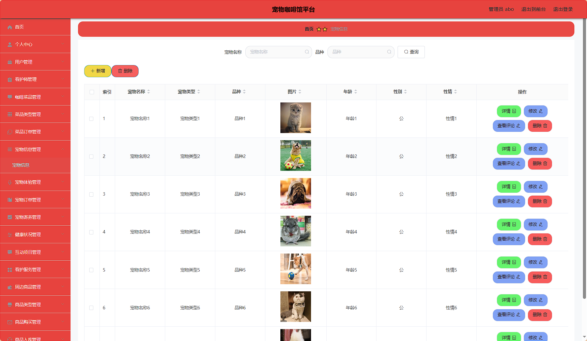

# 宠物咖啡馆平台 / Pet-Cafe-Management-System


> 更多毕设项目可跳转至项目导航栏检索：[毕设项目](http://sysadmin.3vfree.vip)，需要联系博主v：xq-lucky311，q：1047944234

## 项目简介  
基于 SpringBoot + MyBatis-Plus + Shiro 的宠物咖啡厅综合管理系统，包含管理员、用户和看护师三端角色，实现咖啡点单、宠物寄养、健康管理、商品销售等核心业务，采用分层架构设计保障系统可维护性。

  
- 后端框架：Spring Boot 2.7+ / MyBatis-Plus 2.3  
- 安全框架：Apache Shiro 1.3.2  
- 数据库：MySQL 5.7+  
- 工具集：Hutool 4.0.12 / Fastjson 1.2.8  
- 接口文档：原生SpringBoot Actuator监控  

## 特征介绍  
- **RBAC权限体系**：Shiro实现管理员/看护师/用户三级权限隔离  
- **高效数据操作**：MyBatis-Plus 自动生成基础CRUD代码  
- **文件管理**：独立文件服务模块实现图片上传存储  
- **多维度建模**：VO/Model/Entity分层处理数据转换  
- **百度AI集成**：通过百度SDK实现智能图像识别能力  
- **交易闭环**：完整订单状态管理（创建-支付-完成）流程  

## 代码结构
```
src/
├── main/
│   ├── java/
│   │   ├── com/
│   │   │   ├── annotation/          # 权限注解
│   │   │   │   ├── LoginUser.java
│   │   │   ├── config/              # 全局配置
│   │   │   │   ├── MybatisPlusConfig.java  
│   │   │   ├── controller/          # 接口层
│   │   │   │   ├── CaipindingdanController.java
│   │   │   ├── dao/                 # 数据访问层
│   │   │   ├── entity/              # 持久化对象
│   │   │   │   ├── model/           # 业务模型
│   │   │   ├── interceptor/         # 请求拦截
│   │   │   ├── service/             # 服务层
│   │   │   │   ├── impl/            # 服务实现
│   │   │   ├── utils/               # 工具类
│   ├── resources/
│   │   ├── mapper/                  # SQL映射文件
│   │   ├── application.yml          # 主配置
│   │   ├── static/                  # 静态资源
│
├── test/                            # 单元测试
```
## 使用说明
1. 启动前配置 application.yml 数据库连接：
```yaml
spring:
  datasource:
    url: jdbc:mysql://localhost:3306/springbootx9rzc
    username: root
    password: 123456
```

2. 访问地址：
后台管理：http://localhost:8080/springbootx9rzc/admin/dist/index.html
用户端：http://localhost:8080/springbootx9rzc/front/index.html

3. 默认账号：
管理员：abo/abo
看护师：工号注册后由管理员授权

4. 开发工具要求：
JDK 1.8+
IntelliJ IDEA / Eclipse
MySQL 5.7+

# 项目实际截图：

## 前台：


## 后台：





> 等等...

# 精选项目导航 & 快速部署工具
## 项目资源一站直达
- ​**访问项目导航站**：[点击进入](http://sysadmin.3vfree.vip)**快速检索所需项目名称**
- ​**技术栈全覆盖**：Java/SSm/Spring Boot/小程序等主流技术方案
- ​**配套资源**：每个项目均提供部署文档 + 演示视频（附效果截图）

### ▌导航站预览


### ▌工具界面预览


## 捐赠
> 博主将持续更新Java全栈开发项目，包含ssm，springboot，前后端分离系统等项目。
> 此外如果您够宽裕，请博主喝杯咖啡吧！捐赠将用于服务器维护与开源社区建设，感谢您的认可！
> 如需更多Java相关项目毕设3000+，有其他项目需求，sql文件等可联系博主v:xq-lucky311

---